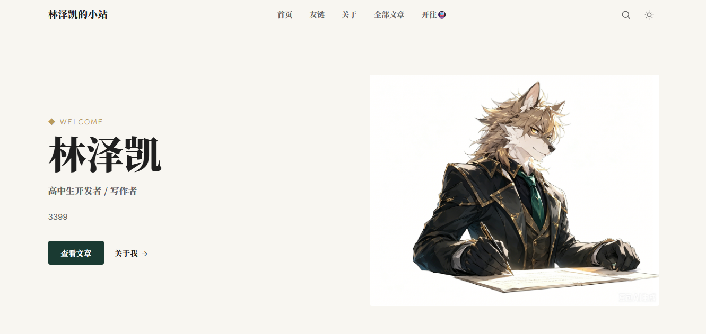

# Li CW 创作主题

极简 WordPress 个人博客主题，为写作者与独立开发者设计。



## 特性

- 🌓 **明暗双模式** — 自动跟随系统，无缝切换
- 📱 **全响应式** — 桌面/平板/手机自适应
- 🖼️ **图片灯箱** — 点击放大，滚轮缩放，双指旋转，键盘导航
- 📑 **文章目录** — 自动生成 TOC
- 💬 **弹窗评论** — 精简表单，草稿自动保存，支持评论置顶
- 🎨 **可视化自定义** — 配色/字体/首页/页脚/关于页全部后台配置
- ⚡ **按需加载** — 代码高亮、灯箱、目录仅在需要时加载资源
- ✍️ **作品集 + 友链** — 独立 CPT 作品管理 + 原生链接管理器
- 📷 **照片墙** — 独立 CPT 照片管理，每张照片支持简介与评论
- 🧹 **性能优化** — 去除 WP 冗余资源，原生懒加载
- 🎭 **动画编排** — 滚动揭示，弱动偏好保护

## 安装

1. 在release下载最新的主题zip
2. 后台 → 外观 → 主题 → 添加 → 上传主题
3. 上传并启用

或解压后 FTP 上传至 `/wp-content/themes/li-cw-theme/`。

## 基础配置

1. **设置首页**：后台 → 设置 → 阅读 → 静态页面，指定首页和文章页
2. **创建菜单**：外观 → 菜单 → 勾选「主导航」显示位置
3. **自定义外观**：外观 → 自定义，配置配色/字体/首页/关于/页脚
4. **添加作品**：后台「作品」→ 添加，支持设置状态、分类、外链
5. **添加友链**：后台「链接」→ 添加，头像/名称/网址/描述
6. **创建照片墙**：新建页面 → 选择「照片墙」模板 → 发布。在后台「照片」→ 添加照片（上传特色图、填写简介、开启评论）

## 快捷键（灯箱）

| 按键 | 操作 |
|---|---|
| `←` `→` | 上/下一张 |
| `Esc` | 关闭 |
| 滚轮 | 缩放 |
| `Alt` + 滚轮 | 旋转 |
| `R` | 顺时针旋转 90° |
| `Shift` + `R` | 逆时针旋转 90° |
| `0` / 双击 | 重置变换 |

## 常见问题

**首页按钮点击无反应？** → 确认设置了静态首页和文章页。

**代码块无高亮？** → 使用编辑器「代码块」，非「预格式化」块。

**更新主题会丢失配置？** → 自定义器配置保存在数据库，上传覆盖即可。

## 评论置顶

主题支持将任意顶层评论置顶（排在评论列表最前，并显示金色"置顶"徽标）。通过 WP-CLI 操作：

```bash
# 置顶评论
wp comment meta update <评论ID> li_cw_pinned 1

# 取消置顶
wp comment meta delete <评论ID> li_cw_pinned
```

仅对顶层评论生效（回复评论不受影响）。

## 开源协议

GNU General Public License v2.0 or later
